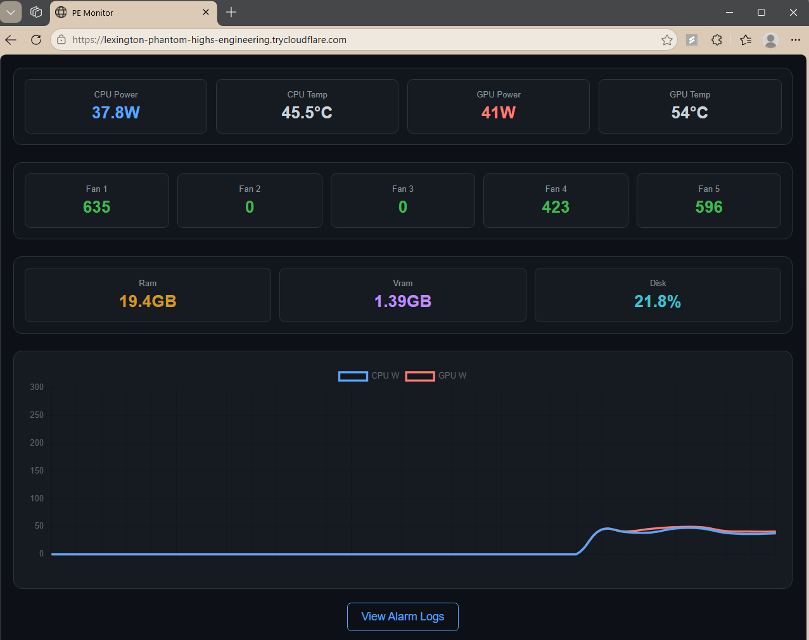

# PEMonitor: Processor & Excursion Monitor
A real-time hardware monitoring dashboard and alarm logger. It scrapes data from **LibreHardwareMonitor** on Windows, providing a web interface and a log that records critical hardware events.

---
## Features
- **Real-Time Dashboard**: Monitor CPU/GPU power, temperatures, fan speeds, and ram/disk utilization
- **Intelligent Logging**: Only records data when hardware crosses "Alarm" thresholds (e.g., Temp > 82°C)
- **Live Logs**: A dedicated log page that updates in real-time via AJAX as spikes occur
- **Headless Architecture**: Optimized to run as a background systemd service
---
## Project Structure
```text
pemonitor/
├── app.py           # Flask Web Server & Routing
├── sensors.py       # Sensor parsing & Alarm logic
├── pc_stats.csv     # Generated Alarm Logs (ignored by git)
├── templates/       # UI Templates
│   ├── index.html   # Main Dashboard
│   └── logs.html    # Real-time Log View
└── requirements.txt # Python Dependencies
```
---
## Setup Instructions
### 1. Windows Source (Data Provider)
1. Download and run [LibreHardwareMonitor](https://github.com/LibreHardwareMonitor/LibreHardwareMonitor) **as an administrator**.
2. In LHM: Go to **Options** and enable **Run on Windows Startup**, **Start Minimized**, and **Minimize on Close**.
3. Under **Options → Remote Web Server**, set the port to `8085` and click **Run** to enable the data stream.

> **Firewall Note:** If a firewall rule for the WSL-to-LHM bridge does not exist, create one by running the following in an **elevated PowerShell** window:
> ```powershell
> New-NetFirewallRule -DisplayName "WSL to LHM" -Direction Inbound -Action Allow -Protocol TCP -LocalPort 8085
> ```
> To verify the rule is active later:
> ```powershell
> Get-NetFirewallRule -DisplayName "WSL to LHM"
> ```

### 2. Linux/WSL Setup
1. Clone the repository:
```bash
git clone https://github.com/Tech13-08/pemonitor.git
cd pemonitor
```
2. Ensure [uv](https://github.com/astral-sh/uv) is installed, then create the virtual environment and install dependencies:
```bash
uv venv
uv pip install -r requirements.txt
```

> **Keeping WSL Running in the Background:** To keep WSL alive even after closing all terminals, run the following in an **elevated PowerShell** window:
> ```powershell
> wsl --exec dbus-launch true
> ```

### 3. Run as a Service (Systemd)
1. Create the service file:
```bash
sudo nano /etc/systemd/system/pemonitor.service
```
2. Paste the following configuration (replace `youruser` with your actual username):
```ini
[Unit]
Description=Power Monitor Service
After=network.target
[Service]
User=youruser
WorkingDirectory=/home/youruser/pemonitor
ExecStart=/home/youruser/pemonitor/.venv/bin/python /home/youruser/pemonitor/monitor.py
Restart=always
[Install]
WantedBy=multi-user.target
```
3. Reload systemd and start the service:
```bash
sudo systemctl daemon-reload
sudo systemctl enable pemonitor
sudo systemctl start pemonitor
```

The `pemonitor.service` file lives at `/etc/systemd/system/pemonitor.service`. Use `sudo systemctl start pemonitor` to start the service and `sudo systemctl enable pemonitor` to set it to run automatically on boot.
If you have a cloudflare service running to utilize a quick tunnel, you can run `journalctl -u pemonitor_cftunnel.service | grep trycloudflare.com` to find that quick tunnel address assuming `pemonitor_cftunnel.service` is the name of your service.
---
## Threshold Settings
You can customize when an alarm is triggered by editing `sensors.py`. The defaults are:
| Sensor    | Default Threshold |
|-----------|-------------------|
| CPU Temp  | 82.0 °C           |
| GPU Temp  | 82.0 °C           |
| CPU Power | 150.0 W           |
| GPU Power | 300.0 W           |
---
## Dependencies
Ensure your `requirements.txt` contains:
```text
flask
requests
pandas
```
---
## License
[MIT](https://choosealicense.com/licenses/mit/)
