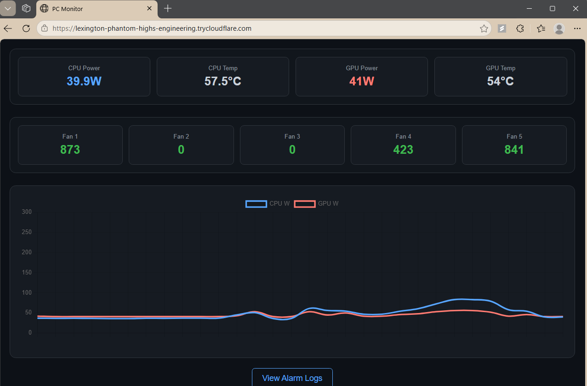

# PEMonitor: Processor & Excursion Monitor

A real-time hardware monitoring dashboard and alarm logger. It scrapes data from **LibreHardwareMonitor** on Windows, providing a web interface and a log that records critical hardware events.


---

## Features

- **Real-Time Dashboard**: Monitor CPU/GPU power, temperatures, and fan speeds
- **Intelligent Logging**: Only records data when hardware crosses "Alarm" thresholds (e.g., Temp > 82°C)
- **Live Logs**: A dedicated log page that updates in real-time via AJAX as spikes occur
- **Headless Architecture**: Optimized to run as a background systemd service

---

## Project Structure

```text
pemonitor/
├── app.py           # Flask Web Server & Routing
├── sensors.py       # Sensor parsing & Alarm logic
├── pc_stats.csv     # Generated Alarm Logs (ignored by git)
├── templates/       # UI Templates
│   ├── index.html   # Main Dashboard
│   └── logs.html    # Real-time Log View
└── requirements.txt # Python Dependencies
```

---

## Setup Instructions

### 1. Windows Source (Data Provider)

1. Download and run [LibreHardwareMonitor](https://github.com/LibreHardwareMonitor/LibreHardwareMonitor).
2. In LHM: Go to **Options → Remote Web Server → Run**.
3. Ensure the port is set to `8085`.

### 2. Linux/WSL Setup

1. Clone the repository:

```bash
git clone https://github.com/Tech13-08/pemonitor.git
cd pemonitor
```

2. Install dependencies:

```bash
uv pip install -r requirements.txt
```

### 3. Run as a Service (Systemd)

1. Create the service file:

```bash
sudo nano /etc/systemd/system/pemonitor.service
```

2. Paste the following configuration (replace `youruser` with your actual username):

```ini
[Unit]
Description=Power Monitor Service
After=network.target

[Service]
User=youruser
WorkingDirectory=/home/youruser/pemonitor
ExecStart=/home/youruser/pemonitor/.venv/bin/python /home/youruser/pemonitor/monitor.py
Restart=always

[Install]
WantedBy=multi-user.target
```

3. Reload systemd and start the service:

```bash
sudo systemctl daemon-reload
sudo systemctl enable pemonitor
sudo systemctl start pemonitor
```

---

## Threshold Settings

You can customize when an alarm is triggered by editing `sensors.py`. The defaults are:

| Sensor    | Default Threshold |
|-----------|-------------------|
| CPU Temp  | 82.0 °C           |
| GPU Temp  | 82.0 °C           |
| CPU Power | 150.0 W           |
| GPU Power | 300.0 W           |

---

## Dependencies

Ensure your `requirements.txt` contains:

```text
flask
requests
pandas
```

---

## License

[MIT](https://choosealicense.com/licenses/mit/)